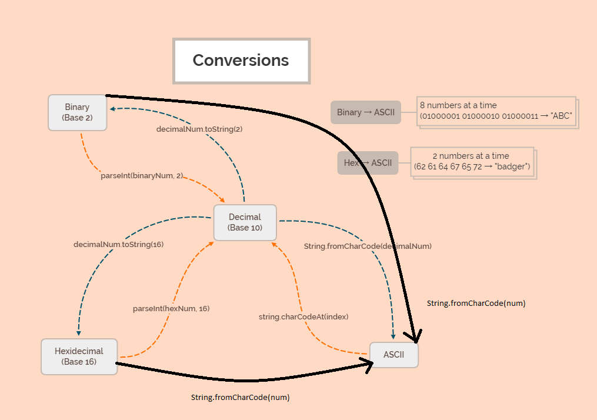

# M2W3D4

## Memory

### RAM

- What does it hold?
  - bits, 1s and 0s, in the form of electrical charge
- Is it slow or fast?
  - fast, to read and write
- Persistent or volatile?
  - volatile - HDDs and SSDs are for long-term storage
  - needs a constant electric power source to retain information
- Cheap or expensive compared to hard disk storage?
  - expensive
- How do we access or refer to it?
  - memory addresses, pointers, references

## Arrays

- **most time and space efficient way to store data**
  - **sequence of elements stored in a *contiguous block of memory*** 
  - Packed side-to-side with no wasted memory 
  - Can also *pre-allocate memory* for an array to avoid having to resize it later (which is a Linear O(n) operation) 
    - Use the `Array constructor`

```js
var numObjects = 10;
var myArray = new Array(3*numObjects);
// allocates 30 spaces in memory for this new empty array that's been created
```

- Allow us to access elements through `indexing`
- Want the element at index 5? Move the pointer to the correct location and read the data 
    - Indexing an array is a **Constant O(1) operation**
    - Since the indices are numerical, the array must be stored in an **ordered sequence of memory addresses**

## Stacks

A stack is an *abstract data type* (ADT) that stores a collection of data

- LIFO
  - Add = push
  - Remove = pop
- Implemented with an array under the hood eg. `const stack = [];` and push and pop elements on that array
- Browser history, undo/redo
- *Time complexity*
  - *If memory has been allocated* for the array then adding and removing elements and also checking the size of the stack will be a **Constant O(1) operation** 
  - *If not*, it could be a **Linear O(n)** operation in the worst case scenario
- *Space complexity* of a stack is **Linear O(n)**, because we need `n` array slots to store `n` variables

### **Quick note on Recursion**

- **Minimum space complexity of Linear O(n)**
  - If space is an issue, and your input is large, it's usually better to use an iterative solution

## ASCII:

-   `String.fromCharCode()`

```javascript
console.log(String.fromCharCode(65)); // = A;
console.log(String.fromCharCode(66)); // = B;
console.log(String.fromCharCode(67)); // = C;
```

-   `String.prototype.charCodeAt()`

```javascript
const str = 'ABC';
console.log(str.charCodeAt(0)); // 65 => A;
console.log(str.charCodeAt(1)); // 66 => B;
console.log(str.charCodeAt(2)); // 67 => C;
```

## More Built in JavaScript Conversion Methods:

```javascript
// Convert Hexadecimal to Base10 & back`
let num = parseInt('0xa1', 16); // 161
let str = num.toString(16); // 'a1'
```

