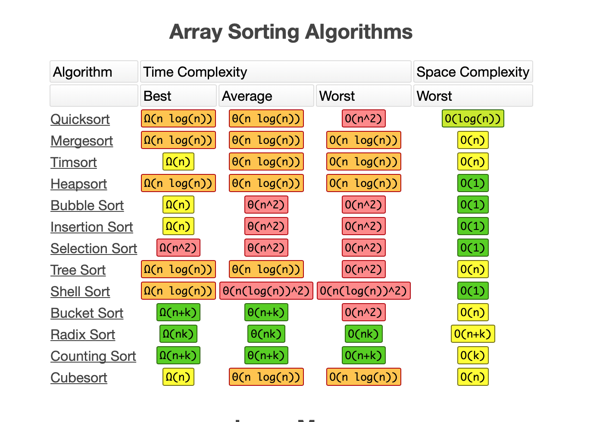

# Weeks 11 + 12 Study Guide

- Binary search concepts (arrays + trees)
- Trees: Binary vs Binary Search vs Traversal
- Different tree traversals: BFS, DFS (using queue, stack, inorder, preorder, postorder), etc.
  - i.e. Given a tree, can you provide the output if asked for pre-order, etc?
- Big O and Time complexity of binary tree operations
- Go over terms:
  - Node: An element in a graph
  - Edges: The connections between nodes, also called a pointer.
  - Root: The ultimate parent, the node of a tree that can access all other nodes
    through edges. The root cannot have a parent.
  - Parent/Child: A Parent node points to a child node.
  - Neighbors: The connections to a given node.
  - Subtree: A Tree whose root node is a child of another node in the tree.
  - Internal Node: A node that has children and has a parent, also called a branch
    node.
  - Leaf: A node that does not have any children. An outer node.
  - Path: A series of nodes that can be traversed through edges.
  - Level: The number of edges between a node and the root node.
  - Height: The number of edges between the root node and the bottom-most node.
- Understand the basics of JavaScript's built in `sort` function and how the comparison callback function works
- Different sorting algorithms
  - Bubble
    - Swapping adjacent pairs until array is sorted
  - Insertion
    - Values chosen randomly to be placed in the correct spot in a sorted array
  - Selection
    - Selecting the smallest value and sorting it until array is sorted
  - Quicksort
    - Divides an array around a pivot then sort the left and right sides
  - Mergesort
    - Divides an array in half, sorts each half, then recombines the halves together in order
- Graph concepts, terminologies, and traversals like BFT, DFT, and which traversal will yield us the shortest path.

- Coding Portion
  - Understand the different traversals: DFS, BFS, etc.
  - Be able to debug the code to work properly w/ the methods used correctly for the given data structure
  - Be able to work with a 2d matrix that represents the graph 
  - Be able to `read mocha spec files for more context`
  - Build a neighbor finder, graph traversal, and apply it to solve a problem
  - Understand the 3 principle of solving graphs
    - `Identify graph type`: and define the type of graph
    - `getNeighbors function`: how to implement this to get the neighbors of a given node from a graph
    - `Traverse graph`: BFT/DFT and do the thing.
  - Recommended projects
    - `Practice assessment`
    - Binary Search Tree Practice
    - Binary Trees Long Practice (Min/Max BST - countNodes) 
    - `Solving graph problems`
    - Basic `breadth/depth first traversal`

