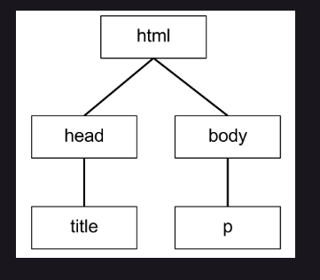

# `M3W5D2`
## Lecture Link
https://us02web.zoom.us/rec/share/db12ELbsCE9o1MV-x4oxK-fniU6VVifkh8bqTkN2otMJVcnrvAlRnhRB0oZOT8I0.gCW9PhGFWltz3xfQ
Passcode: zV4sq%Fe

## DOM vs BOM

---

### Browser Object Model (BOM)

- When interacting directly with the browser you are manipulating the browser
object

- `window` object is the global/umbrella object

  - Consists of all the other BOM objects

  

  

Common properties include:

- screen
- history
- location
- navigator
- document (this is the DOM IE your HTML)

Common methods include:

- alert
  - has a popup window for an alert
- confirm
  - pop up window that displays a message asking for some kind of confirmation. Waits for user to either confirm or cancel
- prompt
  - instructs the browser to display a dialog with an optional message prompting the user to input some text, and to wait until the user either submits the text or cancels the dialog.
- open/close
  - open a new window/tab, or close a tab that was made by an open method.
---

### Document Object Model (DOM)
- DOM, or Document Object Model. The DOM contains a collection of nodes (HTML elements), that can be accessed and manipulated. That sounds an awful lot like window.document doesn't it? Well that's because that's exactly what it represents! In essence, the document object is a Web page, and the DOM represents the object hierarchy of that document.

- Your html page, the document that you are rendering and manipulating.

- We can see the DOM as a kind of tree data structure

- HTML elements can be seen as children of their parent body / head.

- one example of selecting an html element is: document.getElementById() --> show a javaScript representation of an html element.

 - an HTML element is a big object with a lot of properties. notable properties are innerText, innerHTML, children, childNodes

- Easy to `console.log` with `window.document` or just `document` as
an alias.

---
